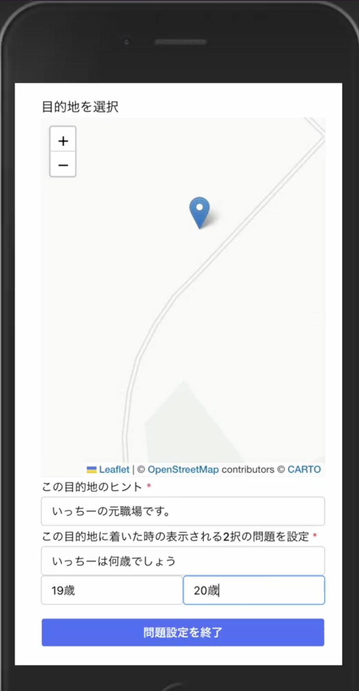
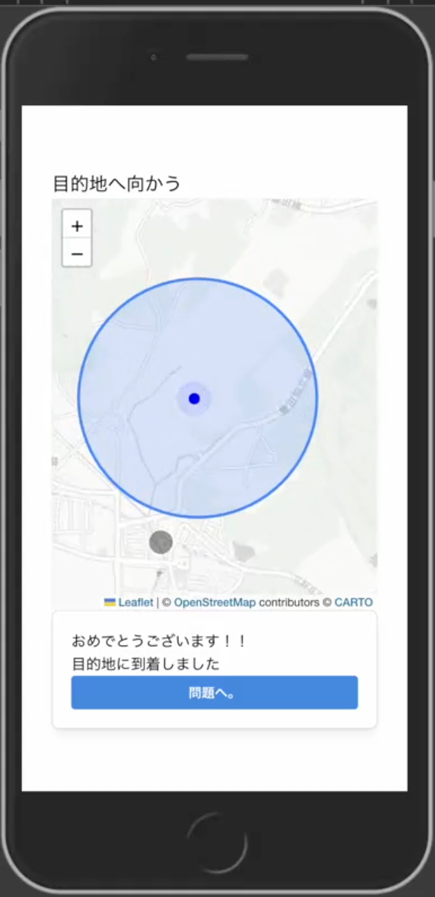

## 1. プロジェクトの概要

# my Treasure

### 概要:

```
このアプリケーションはイベントのアクティビティとしてホスト、ゲストに分かれて位置情報を活用した宝探し形式のクイズゲームを提供します。
```

### 遊び方：

```
１、ホスト：ログインしてクイズを隠す場所をクイズを設定
２、ホスト：生成された URL をゲストに展開
３、ゲスト：URL からアプリを起動
４、ゲスト：クイズが隠してある場所のヒントをもとに付近へ移動
５、ゲスト：設定した場所に行くとクイズが表示されるので回答
```

### スクリーンショット:




## 2. 技術スタック

```
- データベース: PostgreSQL
- その他の技術: Passport(認証関係),leafret(MAP 表示)
```

### フロントエンド:

```
Vite
React Router (ルーティング)
SWR (データ取得、データの管理)
axios (データ取得)
Mantine (UI ライブラリ)
```

### バックエンド:

```
Express
jsonwebtoken (jwt の作成)
bcrypt (ソルト、ハッシュ)
Passport (ログイン機能)
passport-jwt (jwt の認証)
passport-local（パスワード認証)
```

## 3. セットアップ手順

### DB

```
psql
CREATE DATABASE my_treasure

//migrate & seed 実行
//backendディレクトリにいることを確認
npm run migrate
npm run seed

```

### フロントエンド

```
cd frontend
npm install
npm run dev
```

### バックエンド

```
cd backend
npm install
npm run dev
```

## 4. 環境変数の設定

### .env ファイルの内容

```
//バックエンドディレクトリにいることを確認
touch .env

//ファイル内に下記コードを追加
DB_USER=user
DB_PASSWORD=
DB_NAME=my_treasure
```

## 5. 利用可能な API エンドポイントと機能

## 6. デプロイ手順

### Render 側の環境変数の設定

```
// ホスティングサービス: Render
DB_URL:DB作成後、Render側で設定
NODE_ENV:production
```

### Render 側コマンド関係の設定

Build Command

```
cd frontend && npm i && npm run build && cd ../backend && npm i && npm run migrate
```

Start Command:

```
cd backend && npm run start
```
